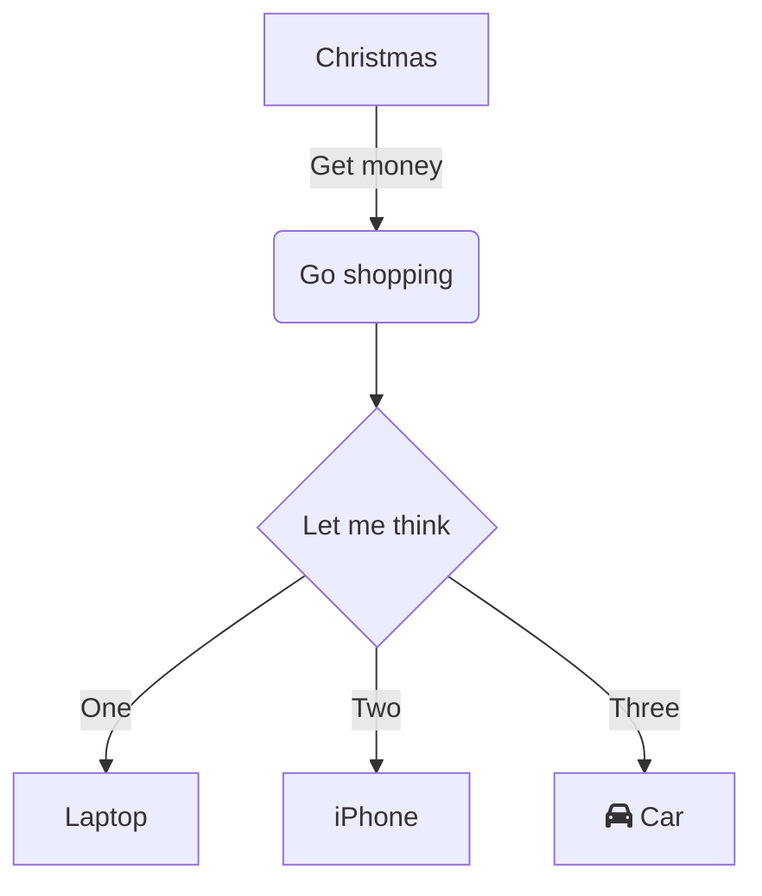

# Links Úteis

# Linq to SQL - Performance
https://learn.microsoft.com/pt-br/dotnet/framework/data/adonet/ef/language-reference/compiled-queries-linq-to-entities

# C# 
https://github.com/TheAlgorithms/C-Sharp

# Fira Code 
git@github.com:tonsky/FiraCode.git

# Humanizer
https://github.com/Humanizr/Humanizer

# LDAP .NET
https://github.com/flamencist/ldap4net

# Polly
https://github.com/App-vNext/Polly

# Tableau
https://github.com/tableau/js-api-samples.git

# Heroku
https://eschechola.com.br/2020/04/15/hospedando-uma-aplicacao-asp-net-core-no-hero

# DevSecOps
https://github.com/OWASP/DevSecOpsGuideline/tree/master/document

# Artigos legais
https://markheath.net/post/functional-programming-big-ideas
https://dev.to/wricke/o-basico-sobre-testes-unitarios-2ehh
https://blog.tonysneed.com/2022/01/28/using-specflow-for-bdd-with-net-6-web-api/
https://dev.to/rupeshtiwari/adding-tag-to-git-branch-in-azure-ci-pipelines-3gcp
https://www.educative.io/courses/visual-introduction-to-algorithms

# SSH .NET
https://github.com/sshnet/SSH.NET

# Mermaid gera graficos como na sintaxe abaixo no vscode. Com o plugin ele fica visualmente bonitos

